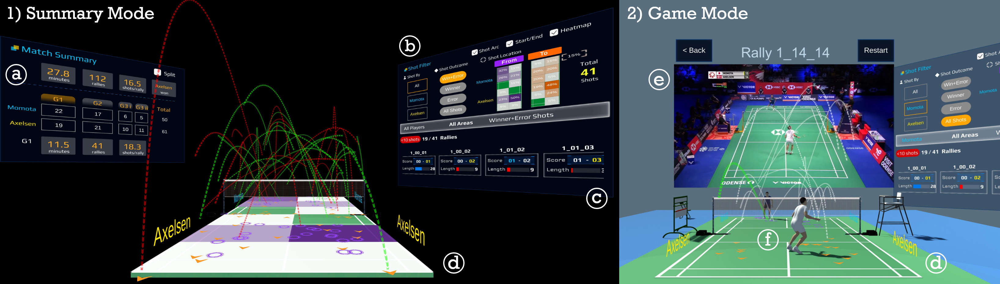
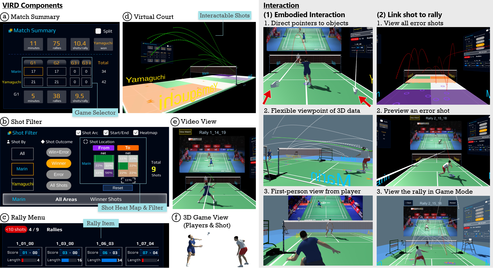

# **VIRD: Immersive Match Video Analysis for High-Performance Badminton Coaching**

The Immersive Badminton Video Analysis VR Prototype is a Unity-based project that enables users to analyze badminton matches in an interactive and immersive virtual reality environment. This repository contains front-end code of the VR interface to set up and run the project with a subset of match data for demo purpose. 
People who wish to use this tool to analyze their own matches should prepare their data in the similar format.

<p align="center">
    
</p>


## **Prerequisites**
- Unity 2021.3.0 or later
- Unity XR Plugin Management (Install via Unity Package Manager)
- Compatible VR headset (e.g. Oculus Rift, HTC Vive)

### **Steps**

1. **Clone this repository:**
 ```bash
git clone https://github.com/ticahere/vird-demo.git
```
2. **Open the project in Unity:**

- Launch Unity Hub and click "Add" 
- Navigate to the cloned repository folder and select it
- Unity will now import the project

3. **Data Processing:**

- Process badminton match data and convert it into a suitable format for the project. This includes player positions, player poses, ball trajectory, rally timing and videos. 

4. **Data Integration:**

- Integrate the processed data into the project under Assets > Resources. 
- Ensure that the match data is correctly associated with the corresponding video.

5. **Load** the Scene **'Match Walktrhough'** under Assets > Scenes

6. **Install** the required XR Plugin and **configure** your VR headset:

7. **Build** and **run** the project:

- Use the controller to navigate the UI and select different panels (SummaryPanel, ShotPanel, VideoPanel).
- Interact with the visualizations (ShotArc, BallTrajectory, CourtHeatMap, VideoCanvas) to analyze match data.

 ## **Features**

VIRD is built upon pre-processed data and consists of two modes of operation
to enable an ideal top-down match analysis:


- **Summary mode**: High-level overview of game statistics and rally filtering
- **Game mode**: 3D reconstructed rally playback with dynamic shot trajectories.

<p align="center">
    
</p>

1. Users start with a high-level **Match Summary (a)**, then refine their analysis using the **Shot Filter (b)**. Detailed rally and shot information is available through the **Rally Menu (c)** and **Situated Visualizations (d)** on a virtual court. 

2. Users can link to **Game View (e)** of a selected shot (Summary
Mode) or an entire rally (Game Mode), featuring synchronized video and **3D dynamic player (f)** and shot representations.


<p align="center">
    
</p>


## **Scene** 
(Assets/Scenes)
`Match Demo` - current coaching video analysis demo

* Camera
    * XR Origin, Controller
* Data
    * MatchDataManager: manage match data update with `MatchData`, `MatchInteraction`
    * VideoPlayer
* UI
    * `SummaryPanel`
    * `ShotPanel`
    * `VideoPanel`
* Visualization
    * `ShotArc`
    * `BallTrajectory`
    * `CourtHeatMap`
    * `VideoCanvas`
* Scene
    * Anchor Area
    * Player_top
    * Player_bottom
    * Badminton court
    * Origin

(Assets/Resources)
`demo_match0` - folder containing demo rallies. Replace with your own match data in similar format.
* ball_trajectory_3d: 3D coordinate of the predicted shot trajectories by rally
* rally_video: rally video footage
* player_poses: 2D coordinate of the predicted player poses
* player_position: 2D coordinate of the predicted player position
* shot: predicted timing of the hit frame (1 = hit, 0 = not hit)
* summary: metadata of each rally 


## Key components 

`MatchData.cs` - main script to load match data, update other game components

`MatchInteraction.cs` - manage interaction and update other game components through MatchData

`SummaryPanel.cs` - control summary panel view, allow filtering rally-level data

`ShotPanel.cs` - control shot panel view, allow filtering shot-level data

`VideoPanel.cs` - control video panel view, allow select a rally video to be played on 

`Trajectory.cs` - control 3D dynamic trajectory played on Badminton court

`Shot.cs` - - control shot arcs drawn on Badminton court

`Heatmap.cs` - - control heatmap visualization drawn on Badminton court
